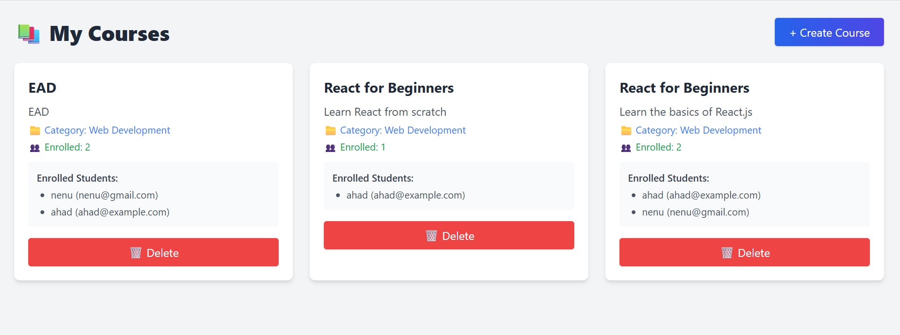
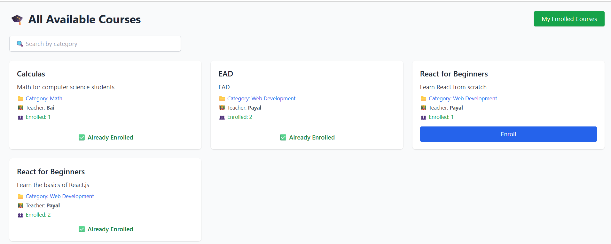
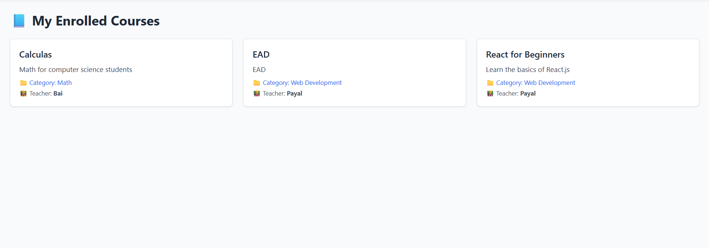

# 🎓 Student-Tutor MERN Platform

A full-stack **MERN (MongoDB, Express, React, Node.js)** web application for managing online courses with role-based access.

## 🚀 Features

### 👨‍🏫 Teachers
- Register & log in
- Create new courses
- View and manage their own courses
- View enrolled students
- Delete courses

### 👨‍🎓 Students
- Register & log in
- Browse available courses
- Search courses by category
- Enroll in courses
- View enrolled courses

## 🛠️ Tech Stack
- **Frontend**: React + Vite + Tailwind CSS
- **Backend**: Node.js + Express + MongoDB
- **Authentication**: JWT-based role-protected routes

## 💡 Highlights
- Clean and responsive UI
- Role-based protected routes
- Enroll and track course participation
- Teacher-specific content management

-----
## Teacher Side

---

## Login / Register

---

## Student Side

---

> Built with ❤️ using MERN stack.